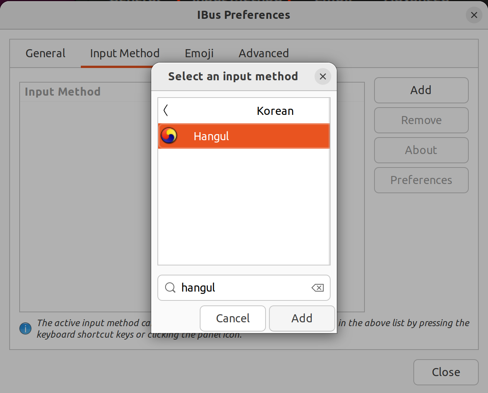
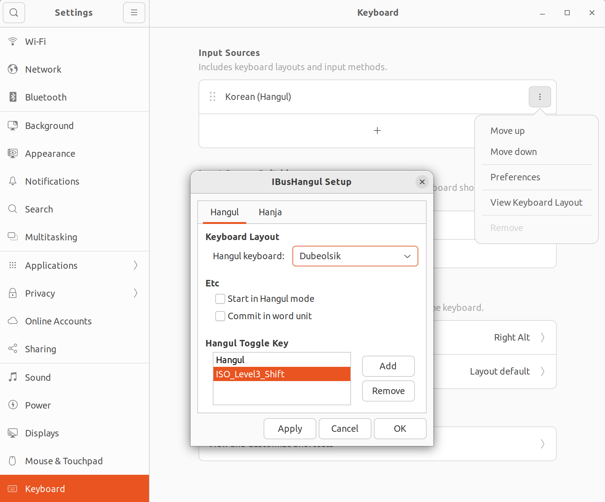

# Ubuntu

- wiki: [lenovo](https://wiki.ubuntu.com/Lenovo)

## Start

### Remove Snap

- [Remove Snap Ubuntu 22.04 LTS](https://haydenjames.io/remove-snap-ubuntu-22-04-lts/)
- [Uninstall Snap Packages from Ubuntu and Other Linux Distros](https://itsfoss.com/remove-snap/)
- [Ubuntu에서 스냅(snap)을 제거 하는 방법](https://dragontory.tistory.com/445)

#### Package List

```bash
snap list

bare
core20
core22
firefox
gnome-3-38-2004
gnome-42-2204
gtk-common-themes
snap-store
snapd
snapd-desktop-integration
```

#### Remove Packages

```bash
snap remove --purge firefox
snap remove --purge snap-store
snap remove --purge gtk-common-themes
snap remove --purge gnome-3-38-2004
snap remove --purge gnome-42-2004
snap remove --purge snapd-desktop-integration
# snap remove --purge core22
snap remove --purge core20
snap remove --purge bare
```

```bash
sudo rm -rf /var/cache/snapd
```

#### Unmount /snap

```bash
df -ah

/dev/loop3       74M   74M     0  100% /snap/core22/858
/dev/loop14      41M   41M     0  100% /snap/snapd/19993
```

```bash
umount /snap/core22/858
umount /snap/core22/858
```

#### Unmount ZFS /var/snap

```bash
zfs list

rpool/ROOT/ubuntu_3bss94/var/snap    488K  /var/snap
```

```bash
sudo zfs unmount /var/snap
```

#### Remove snapd

```bash
sudo apt autoremove --purge snapd
```

#### Remove Directories

```bash
sudo rm -rf /snap
sudo rm -rf /var/snap
sudo rm -rf /var/lib/snapd
```

#### Remove the last snap directory

```bash
cd $HOME
rm -rf ./snap
```

#### Stop snapd

```bash
sudo systemctl list-units | grep snapd

# nothing
```

```bash
# sudo systemctl disable snapd.service
# sudo systemctl disable snapd.socket
# sudo systemctl disable snapd.seeded.service

sudo systemctl mask snapd.service
```

#### Mark APT

##### apt mark

```bash
sudo apt-mark hold snapd
```

```bash
apt-mark showhold

snapd
```

##### dpkg hold

```bash
echo "snapd hold" | sudo dpkg --set-selections
dpkg --get-selections | grep snap
```

##### aptitude hold

```bash
sudo aptitude hold snapd
sudo aptitude upgrade
```

#### Block Snap

```bash
sudo vi /etc/apt/preferences.d/nosnap

Package: snapd
Pin: release a=*
Pin-Priority: -10
```

```bash
sudo vi /etc/apt/preferences.d/nosnap-firefox

Package: firefox*
Pin: release o=Ubuntu*
Pin-Priority: -1
```

```bash
sudo apt update
```

### Install gnome-software

```bash
sudo apt install --install-suggests gnome-software
```

#### gnome tweaks

1. Search: `tweaks`
2. Download `GNOME Tweaks`

##### Caps Lock to Ctrl

1. Tweaks
2. Keyboard & Mouse
3. Additional Layout Options
4. Ctrl position
5. Caps Lock as Ctrl

##### Hangul

```bash
ibus-setup
```

1. Input Method
2. Add: `Hangul` in Korean



Settings:
1. Keyboard
2. Input Sources
3. Add `Hangul`
4. Preferences - IBusHangul Setup
5. Hangul Toggle Key



### Install Firefox

```bash
sudo add-apt-repository ppa:mozillateam/ppa
```

Auto PPA Update:

```bash
sudo vi /etc/apt/apt.conf.d/51unattended-upgrades-firefox

Unattended-Upgrade::Allowed-Origins:: "LP-PPA-mozillateam:${distro_codename}";
```

```bash
sudo vi /etc/apt/preferences.d/ppa-firefox

Package: firefox*
Pin: release o=LP-PPA-mozillateam*
Pin-Priority: 501
```

```bash
sudo apt update
```

```bash
sudo apt install -t 'o=LP-PPA-mozillateam' firefox
```

### Install Packages

```bash
sudo apt install build-essential
sudo apt install curl
```

#### zsh

```bash
sudo apt install zsh
chsh -s $(which zsh)
```

```bash
autoload -Uz zsh-newuser-install
zsh-newuser-install -f
```

---

## Terminal

### xclip for nvim

- [xclip](https://github.com/astrand/xclip)

```bash
sudo apt install xclip
```

---

## .deb

### Get a .deb package

```bash
apt download [package]
```

#### Extract a .deb package

```bash
mkdir package_deb
dpkg-deb -R pakcage.deb package_deb/
```

`.deb`:

```bash
DEBIAN/
usr/
```

#### Extract a control file

```bash
mkdir package_deb
dpkg-deb -e package.deb/
```

`DEBIAN`:

```bash
control
md5sums
```

